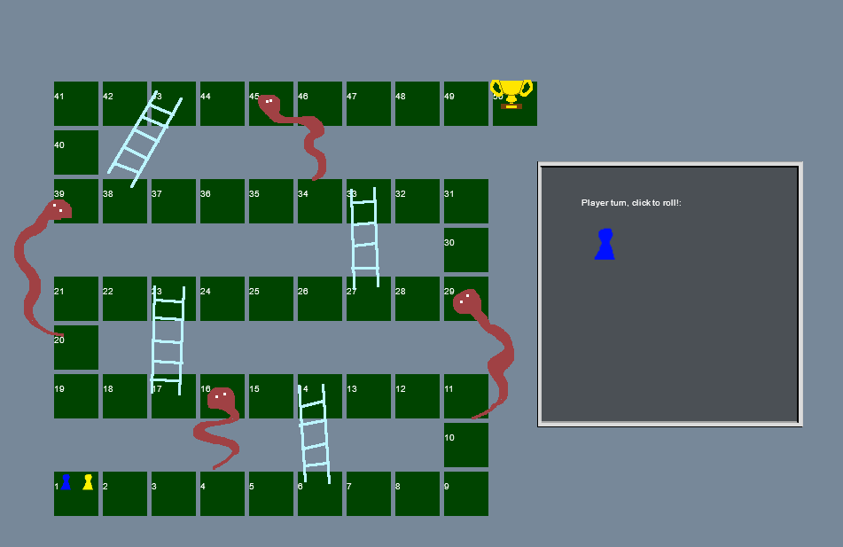

## Snakes and ladders

we gaan nu in de browser een bord spel maken:
snakes and ladders.



Makkie toch? alleen rollen en pionnen verplaatsen?
Dat valt nog iets tegen.

Maar dat is leerzaam!

```
Er zijn meerdere oplossingen en manieren om dit te maken
Deze readme's volgen 1 manier
```

## Setup

- maak een `git repo` aan voor dit vak `m2flexjs`
- clone die `git repo` naar je laptop
- open de `directory` die je krijgt (`m2flexjs`) in visual studio code

- maak 2 files aan:

```
- index.html
- app.js
```

## snelle HTML setup:

- open nu index.html
- type een `!`, je ziet nu verschijnen:
 
 - druk op `enter` en je krijg:
 

 ```
 best handig toch?
 ```

## een canvas

We gaan een canvas gebruiken, dat is een `html element` waar je zelf op kan tekenen met javascript

- pas index.html aan zodat het hier op lijkt:

 

```
nu hebben we ons canvas & javascript
- zie je die `defer` in de javascript tag? die zorgt ervoor dat de javascript pas gaat draaien NADAT alles geladen is!
- let ook even op het `favicon.png`, dit zorgt ervoor dat we minder fouten in de console krijgen ^^
```

## commit

dat was stap 1, snel committen naar je git