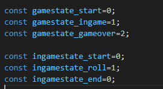

## Variabelen

Ons spelletje zal een aantal variabelen nodig hebben, laten we die gaan aanmaken

## Javascript

- open `app.js` in visual studio code

```
we beginnen met de canvas ophalen zodat we die kunnen gebruiken
```

- type het volgende over in je `app.js`:


## even testen

Elke keer als je een stap uitvoert moet je even testen

- open je `index.html` in je browser.
- ga naar je web developers tools, en check of de console fouten geeft!


## meer variablen

we gaan nog meer variabelen maken:
- type deze over (boven in de file)


```
deze gebruiken niet `let` maar `const`. Dat betekent dat je niet verwacht dat de waarde veranderd. Dus dat die vast staat!
```

en nog meer!


- type deze over (boven in de file)

```
hier maken we wat `arrays` aan om spullen in op te slaan:
- pawnPositions => om de positie van de pionnen in vast te houden
- boardPositions => hier komen onze hokjes van het bord in
- playerAmountButtons => dit worden knoppen voor het startscherm!

- boardPositionSize => dit wordt hoe groot de hokjes worden getekent!
```


## inleveren

commit naar je git