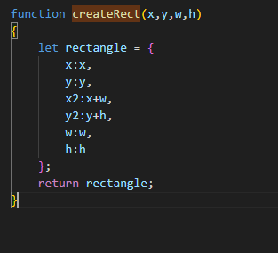
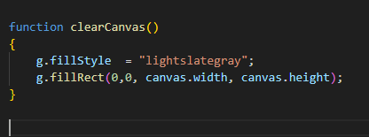
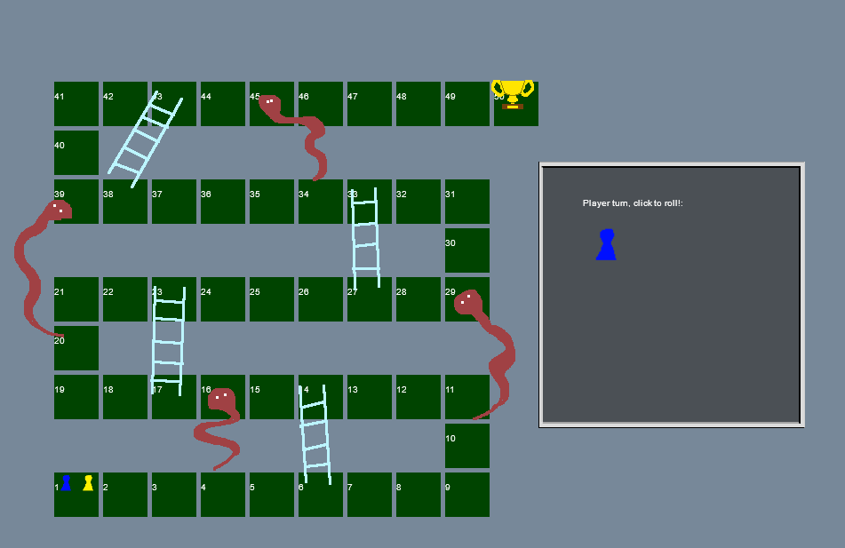
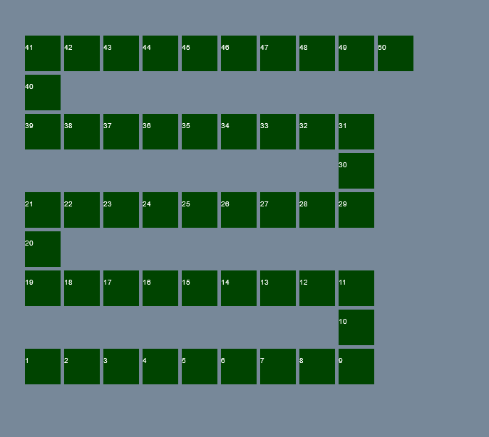

## Bord tekenen

tot nu toe hebben we nog niets op het beeld.

Laten we beginnen met het tekenen van het bord

## Rechthoeken

In spelletjes is het vaak handig om rechthoeken of vierkanten te hebben.
Voor knoppen of sprites.

laten we die gaan maken.

```
We doe het nu op een iets wat oude javascript manier. Je mag ook een `class` gebruiken als je weet hoe dat moet
```

- type de volgende function over in je code:



```
Deze function gebruikt de object notatie. Je krijgt als je deze `called` een object met een x,y,w,h,x2,y2 welke je kan gebruiken
```

## setup om te testen

om te testen moeten we straks kunnen tekenen. Anders zien we niets

we beginnen met het maken van een function om het canvas schoon te maken
- type deze over in je code:



nu gaan we naar de teken code:
- plak deze code in je `app.js` en maak het af (vul de `???` in)
```
function draw()
{
    clearCanvas();
    for(let i =0 ; i<boardPositions.length;i++)
    {
        let pos = boardPositions[i];

        g.fillStyle  = "#004400";
        //we gebruiken hier de x en y van het rectangle object
        // vul bij de ??? ook de h & w in, net als bij de x en y gedaan is!
        g.fillRect(pos.x,pos.y,???,???);
        g.fillStyle  = "#FFFFFF";
        g.fillText((i+1)+"",pos.x,pos.y+20);
    }
}

```

```
Nu hebben we code die het bord kan tekenen
- zie je hoe we in draw() de andere function (clearCanvas()) gebruiken?
- zie je dat we eerst een variable maken (let pos) en daar de boardPosition[i] in stoppen? 
    dat doen we omdat we dan verderop makkelijker kunnen werken.
```

## Truuk!

> dit is uitleg over de code die je bij `## Bord maken` gaat gebruiken:
om het bord aan te maken gaan we een truukje gebruiken.

Ik heb een `path` gemaakt, dat pad gebruikt:
```
- een `1` om aan te geven dat we naar rechts moeten. (+ op de X-as)
- een `0` om aan te geven dat we naar boven moeten. (- op de Y-as)
- een `3` om aan te geven dat we naar links moeten. (- op de X-as)
```
 
We beginnen linksonder zie ook het plaatje:




## Bord maken

- maak een nieuwe function in je file:

```
function createBoardPositions()
{
    let x= 0;
    let y = canvas.height-boardPositionSize;
    let path = [1, 1, 1, 1, 1, 1, 1, 1, 1, 0, 0, 3, 3, 3, 3, 3, 3, 3, 3, 0, 0, 1, 1, 1, 1, 1, 1, 1, 1, 0, 0, 3, 3, 3, 3, 3, 3, 3, 3, 0, 0, 1, 1, 1, 1, 1, 1, 1, 1, 1] ;

    for(let i =0 ; i<path.length;i++)
    {

        if(path[i] == 1)//gaan naar rechts
        {
            //bedenk hier wat je met de x moet doen
            ??? 
        }
        else if(path[i] == 3)//gaan naar links
        {
            // bedenk hier wat je met de x moet doen
            ??? 
        }
        else if(path[i] == 0)//gaan hier naar boven
        {
            //bedenk hier wat je met de y moet doen
            ??? 
        }
        boardPositions.push(createRect(x,y,boardPositionSize,boardPositionSize));
    }
} 
```
- maak de function compleet

## even testen

Nu gaan we testen, onderaan in je file type je:


```
we maken dus eerst het bord aan en daarna tekenen we het
```

- check of jouw resultaat ook er zo uitziet:



## inleveren

commit naar je git
