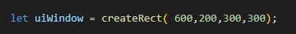
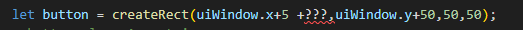
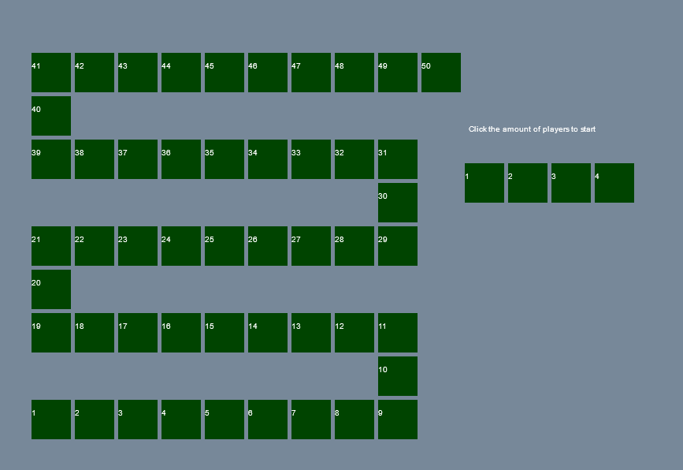

## Starten met het spel


Laten we beginnen met het startscherm
hier kunnen we kiezen of we met 1-4 spelers (met 1 is voor testen) willen spelen

## tekenen

We hadden een variable `playerAmountButtons`, dat is een array waar we knoppen in gaan maken
Laten we een goed startpunt maken:

- maak een `function` met de naam `initGame`
- in deze `function` `call` je de function `createBoardPositions`.
- haal de code hieronder weg (van `03 bord tekenen`)
</br>

```
anders maken we een dubbel bord, dat was toch debug code
```

## uiwindow

We gaan een plekje op het scherm maken waar we de ingame gui laten zien

- zet het volgende boven in je file:
</br>

```
hier maken we een rectangle en bewaren we die in een variable.
* deze gebruiken we straks voor tekenen en om buttons en plaatjes te plaatsen
```

## buttons maken

Nu gaan we buttons maken. Dat worden rectangles (gemaakt met de `createRect` function)

het resultaat wordt straks:
> 


in de `initGame` gaan we 4 buttons maken.
- maak een `for loop` die van `0` TOT `4` gaat
     - doe dit onder `createBoardPositions()` in je `initGame` function 
- zet de volgende code in je for `(tussen de {})`
   </br>
- vul de `???` in, maak gebruik van de `let i` van de loop
   - dit is een keer som:
      - `(i * 50)`
- laat de buttons achter elkaar staan
- voeg ook de volgende regel toe in de `for` onder je `let button`:
```
 button.playerAmount=i+1;
```
- zorg dat de button in `playerAmountButtons` komt!
       > - HINT elke array heeft een `.push()` function


```
deze playerAmount waarde hebben we later nodig als we het spel gaan starten om te bepalen hoeveel spelers je moet maken
- we gebruiken hier de dynamische kant van javascript, je kan gewoon dingen toevoegen aan een object. Later als we classes gaan gebruiken vermijden we dat
- als je het extra net wil doen kan je een function maken die een Button maakt
```

## state toevoegen

zoek even de volgende code op in je code:
</br>

```
hier hebben we 2 `states` gemaakt. Games hebben vaak veel `state machines` onderwater
- hier hebben een algemene gamestate (gamestate_). Dit is soort van op welk scherm we zijn
- de waarden van `ingamestate_` zijn alleen voor als we aan het spelen zijn 
```

- maak boven aan in de file een 2 nieuwe variablen:
</br>

```
deze variabelen houden bij waar we in de game zijn, we beginnen met de start
```

## tekenen per gamestate

> #### UITLEG
> we gaan straks nu functions maken voor elke gamestate, zie de volgende stap:
> - `gamestate_start=0;`
> - `gamestate_ingame=1;`
> - `gamestate_gameover=2;`

</br>

- maak nu functions maken voor elke gamestate:
    - `drawGameStart();`
    - `drawIngame();`
    - `drawGameOver();`

nu zetten we de code om het bord te tekenen in de `drawIngame` function
</br>


## start scherm tekenen

we gaan nu aan de `drawGameStart` function werken

- zorg ervoor dat deze function de buttons in `playerAmountButtons` tekent!
    - gebruik een for loop
    - teken voor nu een rectangle met `fillRect` en zet daar het nummer in met `fillText`
        - deze is op de button te vinden in `playerAmount`
    - vergeet niet de kleur te wisselen! gebruik `fillStyle`
- teken ook de tekst : `Click the amount of players to start`

```
HINT:
- playerAmountButtons is een lijst, waarin 4 buttons zitten
- playerAmountButtons[i] is 1 van die buttons
- elke button heeft een x,y,w,h, en playerAmount
    - voor de x gebruik je dan playerAmountButtons[i].x
```

## draw function aanpassen

pas de draw function aan:
</br>

## init aanroepen

- zet onderaan in je file een `call` naar de function `initGame`
- zet onderaan in je file een `call` naar de function `draw`
    - deze halen we later weer weg naar hebben we nu weer even nodig


## testen

laad je `index.html` in je browser
heb je dit?
</br>

```
oh nu tekenen we alle twee de schermen.
Dat moeten we fixen
```

## gamestate toepassen

Wanneer tekenen we wat?
- ALS `gameState` gelijk is aan  `gamestate_start` dan tekenen we het startscherm
- ALS `gameState` gelijk is aan  `gamestate_ingame` dan tekenen we het het bord

</br>

implementeren:
- de regels hierboven met ALS zijn eigenlijk `if` statements
- maak beide in je `draw` function zodat we alleen het startscherm te zien krijgen
</br>


## inleveren

commit naar je git
