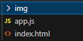
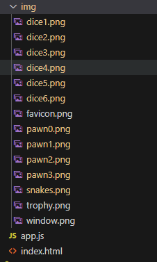
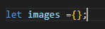
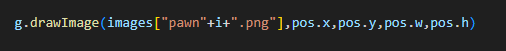
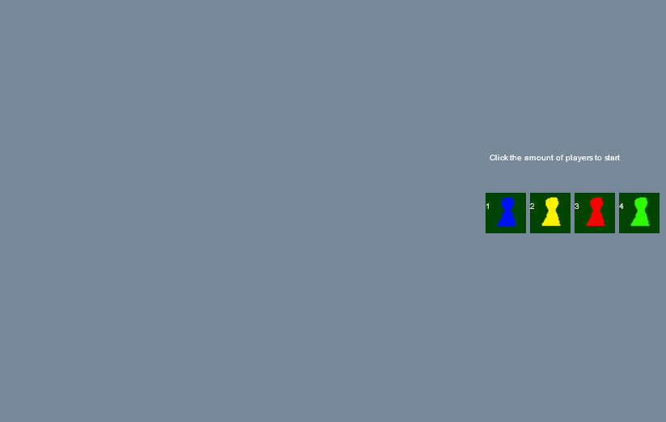

## Plaatjes

een spel zonder plaatjes kan er behoorlijk saai uitzien.
Laten we daar een begin aan maken

## downloaded 

- download de volgende file:  
> [gameimg.zip](./gameimg.zip)  
- pak deze uit naar de directory:
    - `m2flexjs/img`
>   
- dan ziet het er zo uit:
>   

## laden

om plaatjes te laden met javascript hebben we wat ingewikkelde code nodig
deze krijgen jullie cadeau van mij.

```
function loadImages()
{
    let sources = [
        "img/dice1.png", "img/dice2.png", "img/dice3.png", "img/dice4.png", "img/dice5.png", "img/dice6.png",
        "img/pawn0.png", "img/pawn1.png", "img/pawn2.png", "img/pawn3.png", 
        "img/snakes.png", 
        "img/trophy.png", 
        "img/window.png", 
    ];
    
    let scope = this;

    let loaded = 0;
    for (let i = 0; i < sources.length; i++)
    {
        let img = new Image();


        img.onload = function ()
        {
            loaded++;
            if (loaded == sources.length)
            {
                imagesLoaded();
            }
        };
        img.src = sources[i];

        images[ sources[i].replace("img/","")] = img;
    }
}

```

Wow dat is behoorlijk wat code!
- we beginnen met het maken van een array waar alle plaatjes in staan die we moeten `GAAN` laden
- dan gaan we met een `loop` over die `sources` heen
- Javascript heeft een `Image` object, en deze kan iets doen wanneer het plaatje geladen is (`img.onload`). Dus `reageren`` wanneer het laden afgelopen is
- Met de `if` kijken we of we compleet zijn, en als dat klopt gaan we een `imageLoaded()` function aanroepen. Die maken we straks!
- `images[ sources[i].replace("img/","")] = img;` is nog een mooie. hier gebruiken we de dynamiek van javascript. we zetten de `img`, die we geladen hadden, in een object met de naam van het plaatje
    - voorbeeld: 
        - om `img/window.png` te gebruiken kunnen we nu `images.window` in code gebruiken

## images & imageLoaded

- maak boven in de file een nieuwe variable:
</br>

- maak ook een function `imageLoaded`

```
nu gaan we kijken naar wat we moeten aanroepen en in welke volgorde:
- het is logisch om eerst de plaatjes te laden, en daarna de game te gaan starten


```

maak het volgende:
- onder in de file `callen` we nu `loadImages` in plaats van `initGame`
- in `imagesLoaded` `callen` we `initGame` en daarna `draw`
- de `draw` onderaan in de file, halen we weg.


## en nu tekenen!

we hebben plaatjes voor een pionnen, laten we die proberen:
- pawn0.png
- pawn1.png
- pawn2.png
- pawn3.png

```
- zie je dat alleen het getal veranderd?
- zie je dat die van 0- 3 loopt? net als een i in een loop ^^?
```

- zet de volgende code in je `drawGameStart` function

- zorg ervoor dat de pion op het hokje getekend wordt (`volgorde is belangrijk`)

```
zie je dat stuk "pawn"+i+".png"? dat zorgt ervoor dat je 1 van de 4 pion plaatjes pakt (zie ook de images load code)
```


## inleveren

commit naar je git
