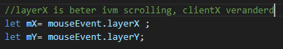

## Clicken

Nu moeten we het spel kunnen starten, daar hebben we clicks voor nodig

## canvas click

We gaan nu een event gebruiken. Html elementen kunnen een `event` laten afgaan als er iets gebeurt. Bijvoorbeeld als er een `click` op gebeurt

- voeg de volgende code toe aan `imagesLoaded`:
</br>


```
we zien in de code dat er een `function` met de naam `canvasClicked` `called` wordt.
maar die function is er nog niet.

Laten we die gaan maken
```

## click function

- maak nu een function met de naam  `canvasClicked`
- deze heeft `1 argument`: `mouseEvent`
- maak deze function

## logica per gamestate

in deze function moeten we per gamestate anders werken.

- maak een `if` die het volgende test: `gameState == gamestate_start`
- nu gaan we over de  `playerAmountButtons` loopen:
</br>

Zie je die `let button`? dat is onze `button` & `rectangle` die heb je later nodig

```
voor elke button moeten we nu gaan controlleren of onze muis in de rectangle zit.
Dat doen we met een function waar we een x, y en een rectangle in stoppen
```

## inRect function

```
onze rectangle heeft een aantal eigenschappen die belangrijk zijn:
- x
- y
- x2
- y2

om te kijken of een punt (px,py) in een rectangle zit gebruiken we de volgende formule:
- px moet `groter' of 'gelijk` zijn aan x 
- px moet `kleiner` of `gelijk` zijn aan x2
- py moet `groter' of 'gelijk` zijn aan y 
- py moet `kleiner` of `gelijk` zijn aan y2

```

- maak de `inRect` function:
</br>
- om de mouse coordinaten te krijgen, moeten we die aan het `mouseEvent` vragen:
</br>
- om te kijken of de mouse in de button clicked:
</br>


## reageren op een button click

om te reageren moeten we met een `if` kijken of `hitButton` `true` is. 

- maak dat in de `for` loop


## game starten

- maak in de `if` de volgende code:
</br>
- maak nu de `function`:
    - `startGame`
- geef deze `1 argument`: 
    - `playerAmount`

## inleveren

commit naar je git