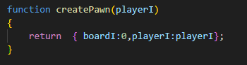

## Starten

We hebben de `click` we hebben de `startgame`... nu nog invullen


## Pion maken

Als we het spel gaan starten moeten we `pionnen` kunnen maken.
Die heten `pawns` in het engels

- voeg de volgende `function` toe aan je code:
</br>

```
Deze function maakt een nieuw object:
- het object houdt bij, bij welke speler die hoort (`playerI`)
- het object houdt bij, waar die op het bord staat.
```

## spel opstarten


- voeg de volgende `function` toe aan je code:
</br>

- kijk of je de `???` in de code ziet
- maak daar 1 pawn aan gebruik `createPawn`
    - geef de `i` van de `for` door naar het argument `playerI` van `createPawn`
    - vang de `return` van `createPawn` op in een variabel
    - voeg dat object in de variabel toe aan `pawnPositions`
        - HINT: elke `array` heeft een `push` function
 
## Test

test je code:
- open de `index.html` in je browser
- open je `web developers tools` in je browser
- click op 1 van de knoppen
    - zie je het volgende:
    
</br>


## pionnen tekenen

Laten we nog wat meer op het scherm toveren. We hebben nu een array met pionnen `pawnPositions`. die gaan we tekenen

- Ga naar de `drawIngame` function
- maak een `for` loop die over `pawnPositions` loopt
- voor elke `i` in `pawnPositions` voegen we de volgende code toe:
</br>

```
die boardI is in welk vakje de pion nu staat
- dat is een index die naar `boardPositions` wijst
- we halen daarmee ook de boardpos op, wat een vakje is
```
- nu kunnen we tekenen, gebruik de g.drawImage function (zie startscherm)
    - pak het juiste plaatje: `images["pawn"+i+".png"]`
    - teken de pawn op de positie van de boardpos
- zorg ervoor dat als je vier spelers hebt het er zo uit komt te zien:
    - HINT: teken de pionnen vanaf de `boardpos`
</br>


## slangen tekenen

- teken nu het ladders en slangen plaatje
    - gebruik `images["snakes.png"]`
    - teken het op: 0,55 met breedte/hoogte: 600,600
</br>

## inleveren

Het begint nu wat te lijken!

commit naar je git