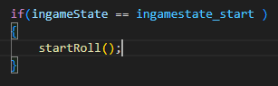
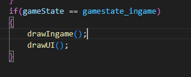
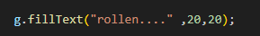
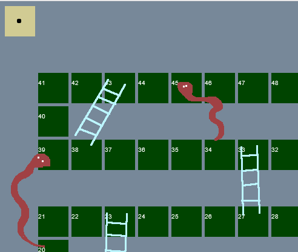
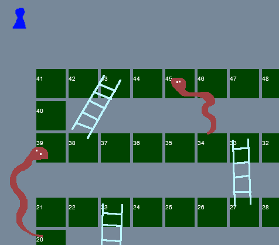

## Clicken om te rollen

- ga naar de function `canvasClicked`
- voeg een `else if` toe, dit test:
    - `gameState==gamestate_ingame`

- in deze function gaan we starten met de dobbelsteen rollen.
- type het volgende in de `{}` van de `if` met `gameState==gamestate_ingame`
</br>
- boven aan de javascript file maken we een nieuwe variabel:
    - `let lastRoll = -1;`
    
## nieuwe functions

- maak 3 nieuwe functions:
    - `startRoll`
    - `endRoll`
    - `drawUI`


## drawUI

eerst even laten tekenen zodat we kunnen zien wat er gebeurt

- ga naar de function `draw()`
- voeg een call naar `drawUI` toe
</br>

- ga nu naar de `drawUI` function
    - maak een `if` die test op `ingameState == ingamestate_roll`
    - in de `{}` *(body of scope)* van die `if` maken we nog een `if`
        - deze test op `lastRoll ==-1`
        - als dat waar is dan tekenen we tekst dat we aan het rollen zijn:
</br>
    - maak nu een `else` die bij de `if` van `lastRoll ==-1` hoort
        - in de `{}` van die `else` tekenen we de dobbel steen
            - `"dice"+lastRoll+".png"`

## startRoll function

dit gaan we doen *(lezen, doen komt later)*:
```
- we zetten de ingamestate op ingamestate_roll
- we zetten de lastRoll op -1 *(dan tekenen we `rollen...` als tekst`)*
- we tekenen door `draw` te `callen`
- daarna gaan we wachten en roepen we endRoll aan
```

- ga naar de `startRoll` function
- zet de `ingamestate` op `ingamestate_roll` *(HINT: gebruik de =)*
- zet `lastRoll` op `-1`
- zet daaronder `draw();`

## timeouts

om te wachten kunnen we in javascript timeouts gebruiken
er is een function `setTimeout` deze function krijgt een andere function mee als argument 1, en daarna een aantal miliseconden wat die moet wachten zie ook:

https://www.w3schools.com/jsref/met_win_settimeout.asp

- zet onder `draw();` in `startRoll` het volgende:
    - `setTimeout(endRoll,500);`
            
## endRoll

nu wachten we 500 miliseconden en daarna roepen we endRoll aan.

- in `endRoll` rol je een heel getal van 1-6. *(hint: Math.floor, Math.random)*
- dat getal zet je in `lastRoll` *(gebruik de =)*
- zet daaronder `draw();` *(nu tekent het plaatje van de dobbelsteen)*
- nu zet je de `ingamestate` naar `ingamestate_end`

als je nu clicked krijg je eerst `rollen...` te zien en daarna:
</br>


## Wiens beurt?

Dat laten we nog niet zien

- ga naar `drawUI` 
- voeg voor `ingamestate_start` toe dat we het speler pionnetje van de speler tekenen
</br>


## inleveren

Bewegen en naar de volgende speler komt later

commit naar je git