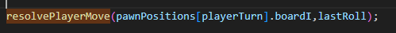
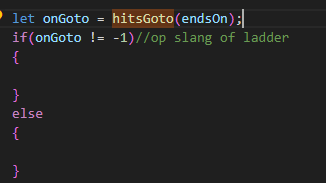
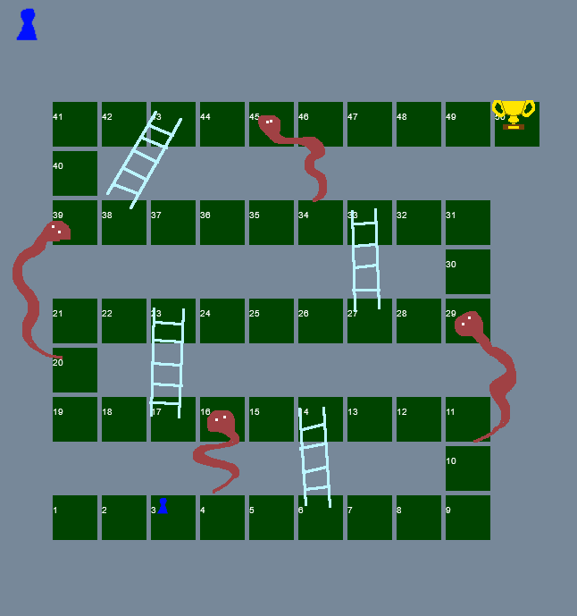
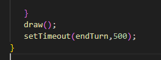
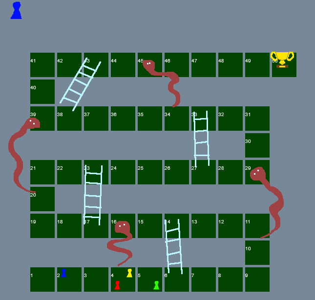

## Nu die pion bewegen

weet je nog dat elke pion bijhield op welke positie/hokje die stond?
- `boardI`?


```
we gaan nu na de dice roll de pion verplaatsen
daarna moeten we het board opnieuw tekenen
daarna hebben we weer een korte pauze
en als laatst gaan we naar de volgende speler
```


## resolvePlayerMove function

Omdat het bewegen van de speler nog best wat dingen moet regelen wordt het een aparte function:

- maak de function `resolvePlayerMove`
- geef deze 2 argumenten:
    - `from` *(waar beginnen we)*
    - `spaces` *(hoeveel bewegen we)*
- roep de function `resolvePlayerMove` aan in de function  `endRoll`
    - op de laatste regel van de function!

</br>


## de function body

Nu gaan we de function vullen

- ga naar de function `resolvePlayerMove`
- maak een nieuwe variabel:
    - `endsOn`
    - geef deze de waarde van: `from` + `spaces`

- maak nog een variable:
    - `finalSpace`
    - geef deze de waarde van de `length` van  `boardPositions` min 1


## eind conditie

Als we de speler bewegen moeten we kijken of de speler op het eind vak komt

- gebruik een `if` om te testen:
    - of `endsOn` gelijk is aan `finalSpace`
    - als dat zo is dan roepen we `showWinner` aan
    - na de aanroep van `showWinner` zetten we een `return` om uit `resolvePlayerMove` te springen en te stoppen

## slangen en ladders

Als de speler op een slang of een ladder eindigd verplaatst de speler nog meer.

Dit maken we later maar we maken alvast een `stub` function die we later gaan invullen:

- maak een function `hitsGoto`
    - geef deze function 1 argument: `endsOn`
    - return nu gewoon `-1` uit de function
- Roep nu in `resolvePlayerMove` *(op het eind)* `hitsGoto` aan:
    - maak ook de if aan
</br>

- in de `else` zetten we nu:
    - `pawnPositions[playerTurn].boardI =endsOn;`

Nu kan de pion verplaatsen:
</br>


## wachten & volgende speler

nu gaan we `setTimeout` weer gebruiken:

- in `resolvePlayerMove` *(op het eind)* na de `draw` zetten we de `setTimeout` neer:
</br>

- maak de `endTurn` function
- in de function body `{}` doe je:
    - `playerTurn++;`
    - je zet de `ingameState` op `ingamestate_start`
    - je called `draw`

## laatste speler?

Dit moeten we nog afhandelen:
- in `endTurn` na `playerTurn++;`:
    - gebruik je een `if` om te kijken of:
        - `playerTurn` groter of gelijk is aan `pawnPositions.length`
    - als dat zo is:
        - zet je `playerTurn` op `0`

## TESTEN!

Start een spel met 4 spelers, rol voor alle spelers dan zie je ze bewegen en kom je weer bij speler 1:
</br>
> Het kan dat als je op een ladder komt (bv als je een `5` gooit vanaf vakje `1`) dat de pion niet beweegt. Dat klopt dat hebben we nog niet gemaakt

## inleveren
commit naar je git