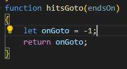
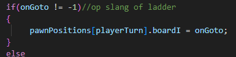

## En die slangen dan?

als je op een slang of ladder eindigd na je worp moet ga je verder of terug op het bord.
Hoe doen we dat?

- zet de volgende code in je `app.js` helemaal bovenin
```
let goto = [[6, 14], [16, 4], [17, 23], [27, 33], [29, 10], [38, 43], [39, 20], [45, 34]];

```

> deze code definieerd welke vakken de speler verplaatsen. Bijvoorbeeld de eerste:
> - [6,14] als je op vak 6 komt ga je naar vak 14
> - de nummers tellen vanaf `1` niet vanaf `0`!!

## goto implementeren

- ga naar de function `hitsGoto`
- maak er de volgende code van:
</br>

> deze code maakt een variabel `onGoto` die start als `-1`
> als we op een vakje komen die in de `goto` array staat gaan we `onGoto` veranderen naar het vakje waar de speler heen moet
> dus als `endsOn` bijvoorbeeld `6` is geven we `14` terug

## vakje checken

- onder `let onGoto ....` gaan we code schrijven
- maak een `for` loop die over `goto` heen loopt
- in de body `{}` van de `for` loop zetten we een `if`
    - deze `if` test of `endsOn+1` gelijk is aan aan de `goto` op `[i][0]`
    > - goto is een array
    > - elke `[i]` van `goto` is ook een `array`, van `2` lang 
    >   - bijvoorbeeld [6,14] zit in `goto` op  `i=0`
    - als dat waar is:
        - geef je `onGoto` de waarde `goto[i][1]-1`

## bewegen

- ga naar de function `resolvePlayerMove`
- zorg ervoor dat je van de `if` welke de `onGoto != -1` test het onderstaande maakt:
</br>

## inleveren
commit naar je git