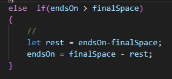
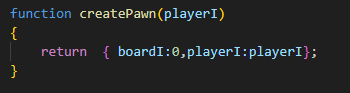
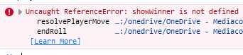

## vakje 50+

als je voorbij het eindvakje gaat moet je teruggaan.
Hoe gaan we dat maken?

- ga naar de function `resolvePlayerMove`
- onder de `if` die `endsOn ==finalSpace` test zetten we een `else if`:

 

## testen

hoe test je dit zonder gek te worden?
- ga naar deze function:
 

- verander `boardI:0` in `boardI:48`
> vergeet het niet straks weer terug te veranderen

- test je code:
    - kan je winnen?
        - als je wint krijg je een error:   
         
    
    - gaat je pion terug?

## showWinner function

- maak de function `showWinner`
- zorg ervoor dat je `gamestate` gebruikt om nu:
    - een win scherm te tekenen
    - op het win scherm kan je clicken om terug te gaan naar het startscherm
    - teken wie gewonnen heeft (het pawn plaatje)
    - teken `trophy.png`
    - teken de tekst `Winner:`
- zie je niets? call `draw`!

## debug code eruit

- ga naar deze function:
 
- verander `boardI:48` in `boardI:0`

## inleveren
commit naar je git